# MATLAB矫正鱼眼镜头
2025/10/29 submit by 郑高星

#### 鱼眼镜头

鱼眼镜头的焦距极短，视角可达到180度甚至更大。鱼眼镜头的设计灵感来源于鱼类的视野，能够捕捉到广阔的场景。其成像原理与普通相机不同，鱼眼相机通常采用等距投影或正距投影，这种投影方式可以将更大的视场压缩到二维图像上，避免传统透视投影的失真。


#### 准备相机图片数据

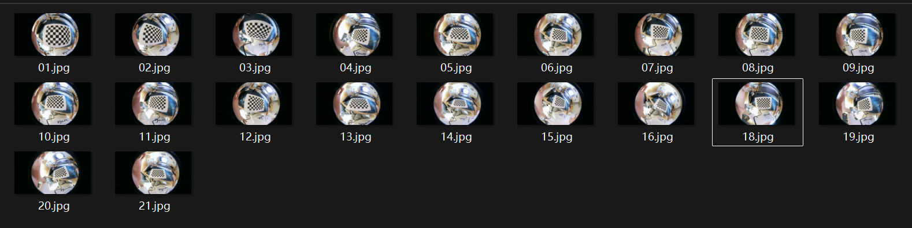

注意事项：

1.要清晰的拍摄棋盘，注意光照

2.不要只在标定板平行面拍摄，最好多个角度

3.可以多拍摄一些，然后效果不太好的可以根据误差剔除

#### MATLAB矫正

打开MATLAB中APP一栏点击下拉框

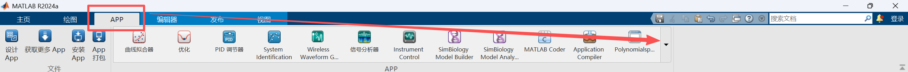

下滑找到图像处理和计算机视觉一栏，点击Camera Calibrator

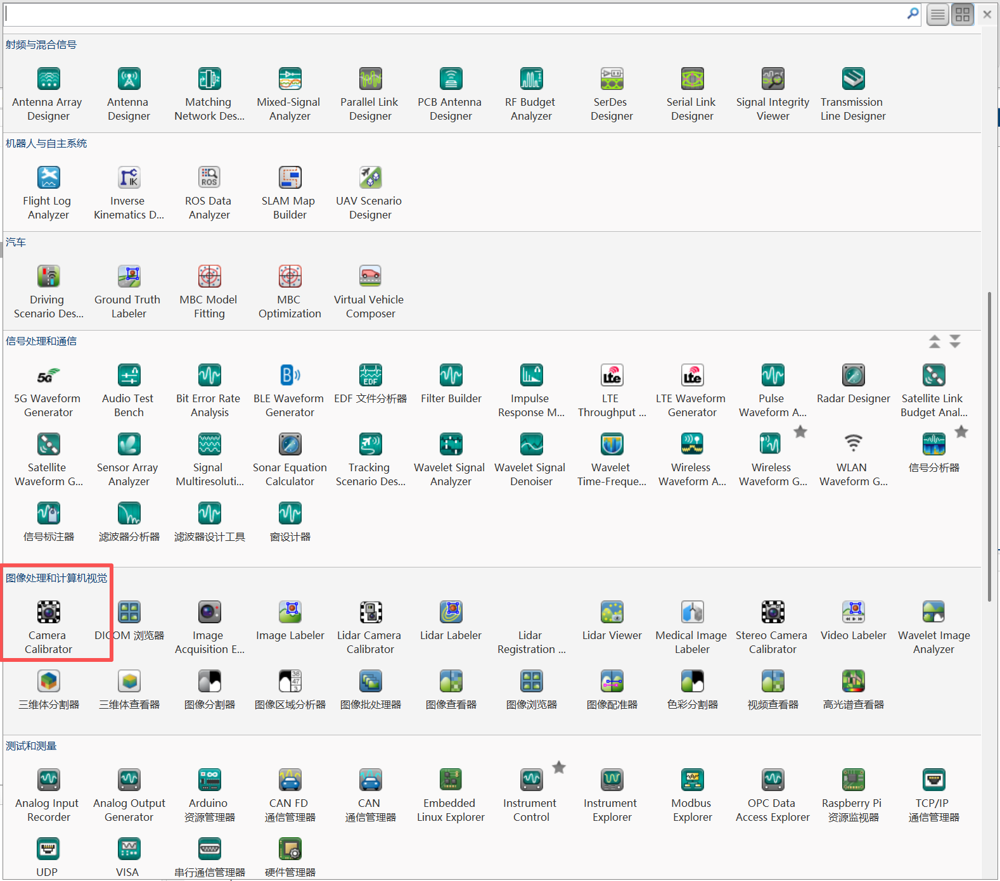

从文件中导入，可以选择images文件夹，或是自己拍摄

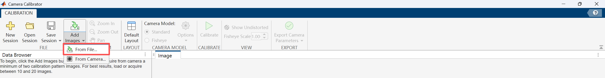

全选导入即可

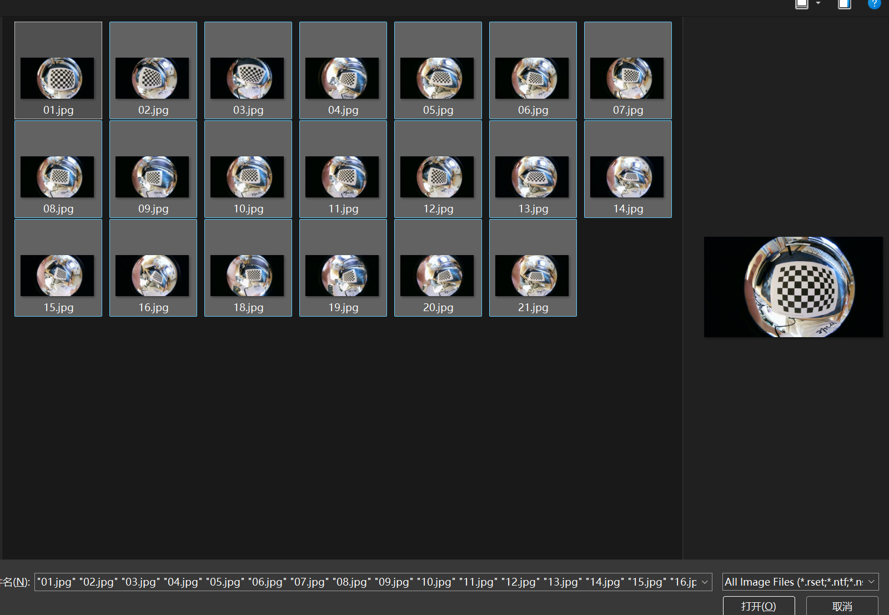

图案选择棋盘格，棋盘格大小根据实际填写，images文件中的棋盘格大小为20毫米

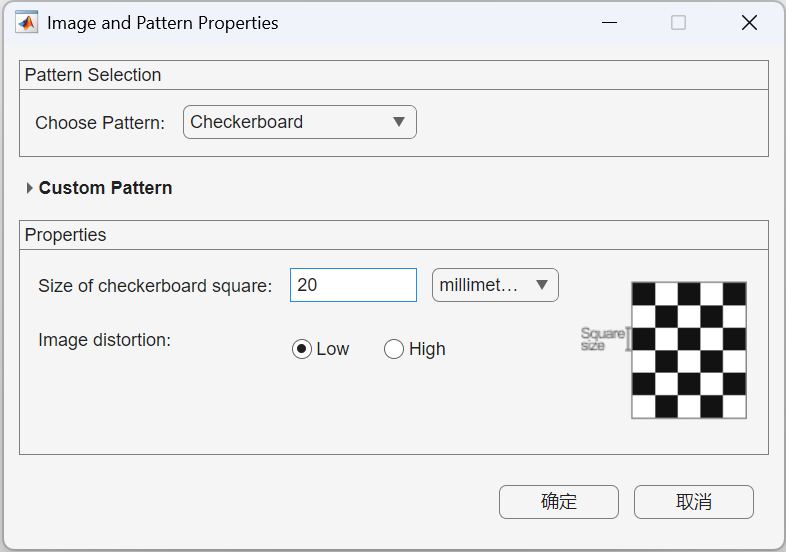

等待导入完成

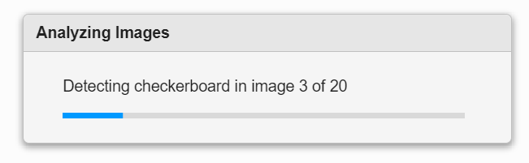

直接点击确定

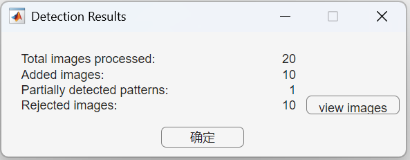

选择Fisheye，勾选Options，点击Calibrate

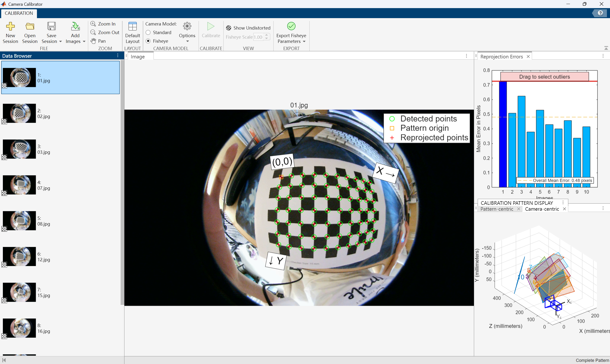

删除一些误差较大的


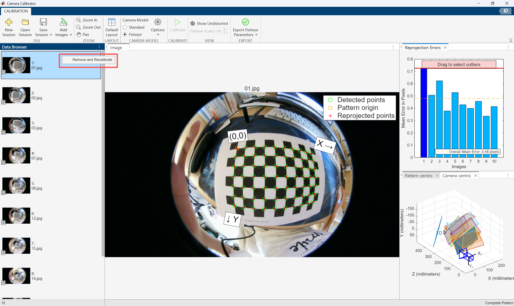

导出参数

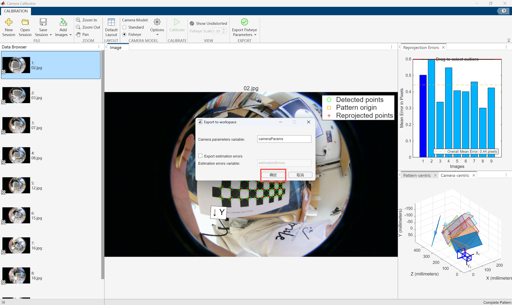

返回MATLAB主界面，发现工作区已经获得了参数

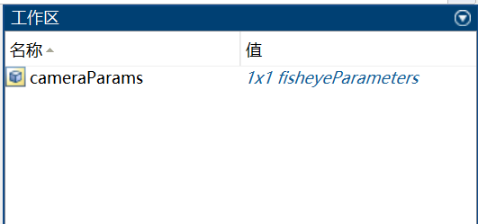

运行下列代码，即可矫正图像

```
img = imread("images\01.jpg");

% 使用获得参数进行矫正
intrinsics =cameraParams.Intrinsics;
% intrinsics = cameraIntrinsics(cameraParams.Intrinsics);
%intrinsics = calibrationSession.CameraParameters.Intrinsics;
%result = undistortFisheyeImage(img, intrinsics);
result = undistortFisheyeImage(img, intrinsics, 'OutputView', 'same');

% 显示结果
subplot(1,2,1); imshow(img); title('鱼眼图像')
subplot(1,2,2); imshow(result); title('校正图像') 

% 更改显示比例
set(gcf,'Visible','off')
set(gcf,'units','normalized','outerposition',[0 0 1 1]);
set(gcf,'Visible','on')
```


可以右键保存参数

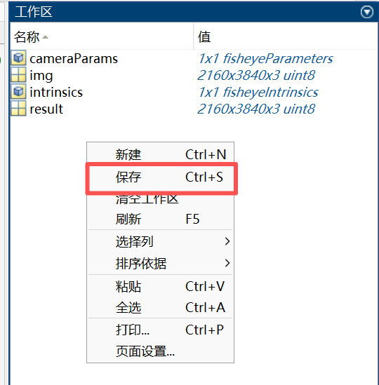

在下一次想要矫正时不用重新导入图片，直接双击即可导入这些参数

