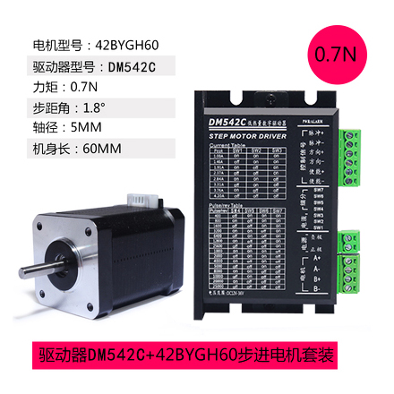
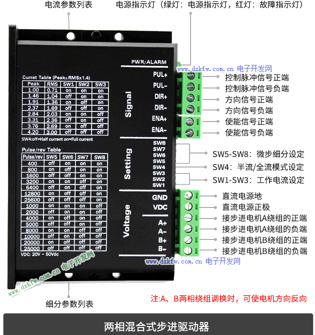
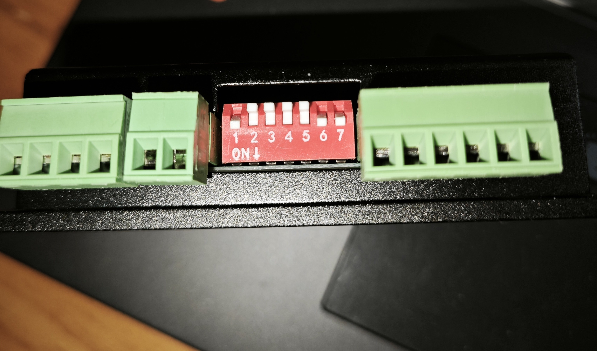
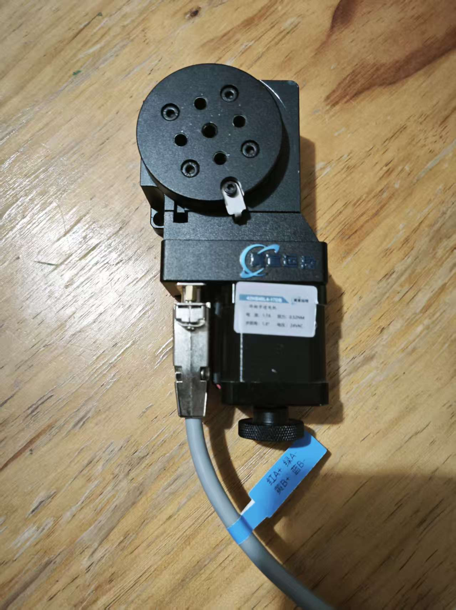
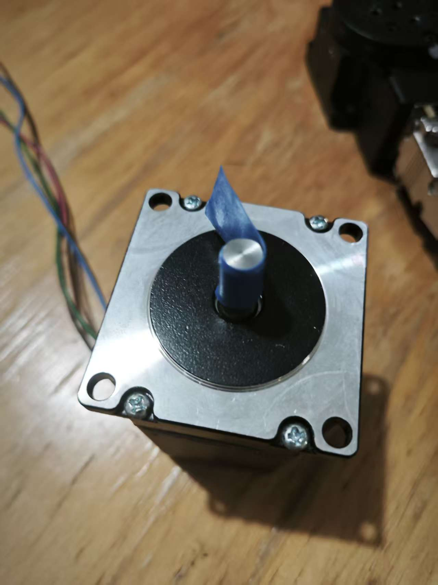
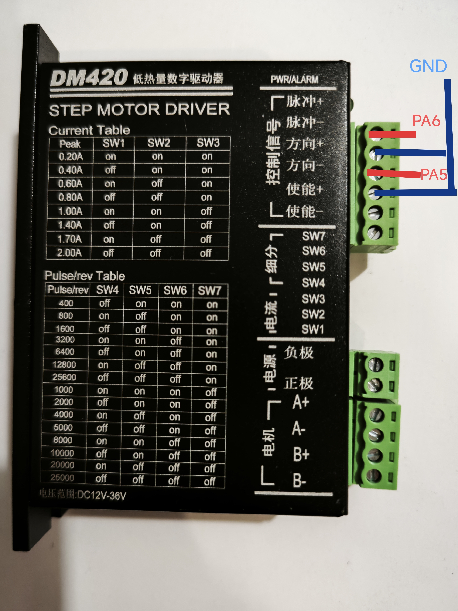
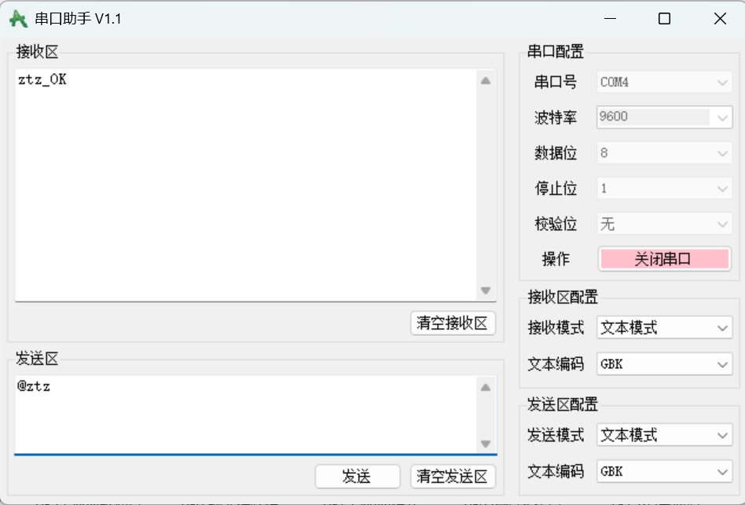

# 使用STM32控制两台步进电机
## 一、硬件组成

**主要元件：**

• STM32F103C8T6 微控制器  
• DM420 步进电机驱动器 × 2  
•24V 电源适配器  
• 42 步进电机 × 2


## **二、软件开发工具**
**keil** 基于江协科技stm32教程代码标准库编写
## **三、 步进电机简介**
&emsp;&emsp;步进电机又称为脉冲电机，简而言之，就是一步一步前进的电机。基于最基本的电磁铁原理,它是一种可以自由回转的电磁铁,其动作原理是依靠气隙磁导的变化来产生电磁转矩，步进电机的角位移量与输入的脉冲个数严格成正比,而且在时间上与脉冲同步，因而只要控制脉冲的数量、频率和电机绕组的相序,即可获得所需的转角、速度和方向。
&emsp;&emsp;实际上，步进电机内部的结构主要是由很多小齿交错而成的，每交错一次步距角就可以缩小一倍，步距角越小则步进电机越精密，旋转一圈所需要的脉冲也就越多。目前市面上不管是42电机，还是57电机，亦或者是86电机，步距角一般都是1.8°。



&emsp;&emsp;

使用 DM420 驱动器控制步进电机时，需要通过 **PWM 脉冲信号** 进行控制。  每接收到一个 PWM 脉冲，步进电机转子就会转动一个**步距角**。  
&emsp;&emsp;因此，若要电机转动指定角度，需输出相应数量的 PWM 脉冲。

## **四、 驱动器简介**

### ①步进脉冲信号（PIL+）（PUL-）：
&emsp;&emsp;步进脉冲信号，全名pulse。步进脉冲信号是控制步进电机的灵魂信号，简而言之，控制步进电机，使能信号端口可以不接，顶多就让电机一直转呗。方向信号也可以不接，顶多步进电机无法改变方向。但是脉冲信号一定要接，根据目前对驱动器的了解，驱动器内部的芯片会根据你的脉冲信号，转换成能让步进电机旋转的信号。
### ②方向控制信号（DIR+）（DIR-）：
&emsp;&emsp;方向控制信号，全名direction。顾名思义，就是可以通过控制这个端口的高低电平进而控制电机的旋转方向。后续我们可以使用这个驱动器的特性实现按键控制电机旋转方向或者其他一些操作。
### ③电机使能信号（EN+）（EN-）：
&emsp;&emsp;电机使能信号，全名enable。顾名思义，就是让电机有旋转的能力和失去旋转的能力，他就相当于一个软件开关，只需要通过代码设计就可以实现步进电机使能或者失能，在失能的状态下，无论做何种操作，电机都不会有反应。
### ④电机两相（A+，A-，B+，B-）：
&emsp;&emsp;按照目前的步进电机来说，市场上目前现行的步进电机一般都是二相步进电机，因为这样做在保证精度的情况下，更省成本。

### ⑤拨码开关：
&emsp;&emsp;拨码开关的sw1-sw3是电流设置，sw4-sw7是细分设置。像42电机，我们假设采用8细分，转一圈需要1600个脉冲。他的额定电流是1.7A，那么我们就需要根据电流设定表，给他设定成 SW1 ON ,SW2 OFF ,SW3 OFF，SW4 OFF ,SW5 OFF，SW6 ON ,SW7 ON。



## 五、 驱动器与步进电机接线
&emsp;&emsp;本项目有两个步进电机，所以需要两个驱动器分别驱动，驱动器电源接到电源适配器的24V输出，电机A+,A-,B+,B-分别与驱动器相接。
&emsp;&emsp;驱动器接线一般有两种，共阴极接法和共阳极接法。其实本质上都是一致的，共阴极即是把EN-、DIR-、PUL-全部都接到控制器上面的GND，也就是把他们全部接为低电位，其他端口只要设置为高电平就可以实现功能；共阳极也就是反过来接线，EN-、DIR-、PUL-全部都接到控制器上面的VCC，也就是把他们全部接为高电位，其他端口只要设置为低电平就可以实现功能。本质上都是检测到电位差实现相关功能。我们在此采用共阴极的接法，并且使能EN都悬空不接线。
⚠️ 所有的GND禁止拧在一起接在同一个GND上，因为两个驱动器之间可能存在微小电位差，串接后可能在信号地之间形成电流环，造成短路烧坏驱动器；并且某些驱动器光耦输入负端不是纯地参考，互相短接会影响信号识别。

### 转台步进电机

接线

### 传送带步进电机

接线


## **六、控制器接线说明**
1.转台 （使用 TIM2）
|电机驱动器|步进电机|STM32|
|:---|:---|:---|
|PUL+/脉冲+| \ |PA2
|PUL-/脉冲-|\ |GND
|DIR+/方向+|\ |PA3
|DIR-/方向-|\ |GND
|B-|B相线-|\
|B+|B相线+|\
|A-|A相线-|\
|A+|A相线+|\

2.传送带（使用 TIM3）
|电机驱动器|步进电机|STM32|
|:---|:---|:---|
|PUL+/脉冲+| \ |PA6
|PUL-/脉冲-|\ |GND
|DIR+/方向+|\ |PA5
|DIR-/方向-|\ |GND
|B-|B相线-|\
|B+|B相线+|\
|A-|A相线-|\
|A+|A相线+|\

## **七、STM32 串口连接**

|模块 |信号 |接口 |说明|
|:---|:---|:---|:---|
USB 转串口模块 |RX |PA9 |串口发送
USB 转串口模块 |TX |PA10 |串口接收

## **八、串口指令说明**
⚠️**所有指令必须以 “@” 开头，并以换行符 \r\n 结尾。**

**串口配置**
|模块 |说明 
|:---|:---|
串口号|对应自己的电脑选择
波特率|9600
数据位| 8
停止位| 1
校验位| 无
接收模式| 文本模式
发送模式| 文本模式
- 转台
“@ztz” 转台正转
“@ztf” 转台反转
“@ztt” 转台停
“@zt50” 转台速度50；速度1到100

- 传送带
“@csdz” 传送带正转
“@csdf” 传送带反转
“@csdt” 传送带停
“@csdz60” 传送带速度60

## **九、系统运行说明**

1. 上电后自动初始化各模块。
  
2. 通过串口发送控制指令，实现实时电机控制。 

3. 调速命令改变 PWM 预分频系数，实现速度控制。  

4. 方向控制通过 GPIO 电平切换实现。
 
5. <串口返回 _OK 表示指令执行成功。


----------

## **十、程序结构与功能说明**

系统主要由以下模块组成：

|模块文件 |功能说明 
|:---|:---|
main.c|主函数，负责系统初始化与串口指令解析
Motor2.c/h|转台与传送带电机控制函数
PWM.c/h|PWM 输出初始化与设置
Serial.c/h|串口通信与中断接收处理


## **十一、主要功能模块简述**

### **1.** PWM.c

用于初始化定时器并输出 PWM 波形控制脉冲频率。
```c
void PWM_TIM2_CH2_Init(uint16_t arr, uint16_t psc)//转台初始化
void PWM_TIM3_CH1_Init(uint16_t arr, uint16_t psc)//传送带初始化
```
### **2.** Motor2.c

定义转台与传送带的初始化、启停、正反转及调速功能。
```c

void Motor2_Start_U(void);//转台正转

void Motor2_Start_D(void);//转台反转

void Motor2_Stop(void);//转台停

void Motor3_Start_U(void);//传送带正转

void Motor3_Start_D(void);//传送带反转

void Motor3_Stop(void);//传送带停

void Motor2_SetSpeed(uint16_t psc);//转台调速

void Motor3_SetSpeed(uint16_t psc);//传送带调速
```
### **3.** Serial.c

实现串口初始化与中断接收数据包的状态机，接收格式为：

@指令内容\r\n
## **十一、详细代码**
**main.c**
```c 
#include "stm32f10x.h" // Device header
#include "Delay.h"
#include "Motor2.h"
#include "PWM.h"
#include "Serial.h"
#include "string.h"
#include <stdlib.h>
/*转台PA2脉冲，PA3方向*/

/*传送带，PA6脉冲，PA5方向*/

/*脉冲：PA6转台，PA1传送带*/

//频率=72000000/（ARR*PSC），周期=1/频率，电机转一圈时间=1600*周期=PSC/450,ARR为100

int main(void)

{

/*模块初始化*/

Motor2_Init(); //转台步进电机初始化；计数周期，即ARR的值100，改变预分频器，即PSC的值来改变速度

PWM_TIM2_CH2_Init(100,288);//PSC=450*转速,初始速度

Motor3_Init(); //传送带步进电机初始化

PWM_TIM3_CH1_Init(100,2250);//PSC=450*转速，初始速度

Serial_Init(); //串口初始化

while (1)
{
if (Serial_RxFlag == 1) //如果接收到数据包
{
/*将收到的数据包与预设的指令对比，以此决定将要执行的操作*/
if (strcmp(Serial_RxPacket, "ztz") == 0) //如果收到ztz指令
{
Motor2_Start_U(); //转台正
Serial_SendString("ztz_OK\r\n"); //串口回传一个字符串ztz_OK
}
if (strcmp(Serial_RxPacket, "ztf") == 0) //如果收到ztf指令

{

Motor2_Start_D(); //转台反

Serial_SendString("ztf_OK\r\n"); //串口回传一个字符串ztf_OK

}

if (strcmp(Serial_RxPacket, "ztt") == 0) //如果收到ztt指令

{

Motor2_Stop(); //转台停

Serial_SendString("ztt_OK\r\n"); //串口回传一个字符串ztf_OK

}

//传送带

if (strcmp(Serial_RxPacket, "csdz") == 0) //如果收到csdz指令

{

Motor3_Start_U(); //传送带正

Serial_SendString("csdz_OK\r\n"); //串口回传一个字符串csdz_OK

}

if (strcmp(Serial_RxPacket, "csdf") == 0) //如果收到csdf指令

{

Motor3_Start_D(); //传送带反

Serial_SendString("csdf_OK\r\n"); //串口回传一个字符串csdf_OK

}

if (strcmp(Serial_RxPacket, "csdt") == 0) //如果收到csdt指令

{

Motor3_Stop(); //传送带停

Serial_SendString("csdt_OK\r\n"); //串口回传一个字符串csdt_OK

}

//转台调速

if (strncmp(Serial_RxPacket, "zt", 2) == 0 && isdigit((unsigned char)Serial_RxPacket[2]))

{

int speed = atoi(&Serial_RxPacket[2]); // 获取数字

if (speed > 99) speed = 99;

uint16_t psc = (-6*(speed+1))+904;

Motor2_SetSpeed(psc);

Serial_SendString("zt_speed_OK\r\n");

}

//传送带调速

if (strncmp(Serial_RxPacket, "csd", 3) == 0 && isdigit((unsigned char)Serial_RxPacket[3]))

{

int speed = atoi(&Serial_RxPacket[3]);

if (speed > 99) speed = 99;

uint16_t psc = (-13.5*(speed+1)+2250);

Motor3_SetSpeed(psc);

Serial_SendString("csd_speed_OK\r\n");

}

Serial_RxFlag = 0; //处理完成后，需要将接收数据包标志位清零，否则将无法接收后续数据包

         }

      }
}
```
## **十二、问题分析**
**步进电机在运行过程中出现“只响不转”的情况该怎样处理**

&emsp;&emsp;检查线路，如果是第一次接线，一定要确认好电机的相位线，或者按照图纸接线,切记两相步进电机的A+A-和B+B-千万不能接错，如果接错可能造成电机堵转，严重的话电机烧毁。驱动器的接线图产品里会有说明书，如果丢失请一定联系客服人员要电子版说明；如果是正在使用的电机出现这个问题，先检查电机线路是否有破损和断开，如果断开，也会造成这种情况。  
&emsp;&emsp;如果步进电机和驱动器的接线没有问题，接下来就检查负载和输入脉冲的频率。  
1.检查负载，负载过重导致，电机脱开负载检查，如果脱开负载能够正常转动，那么说明电机负载过重。  
2.检查输入脉冲的频率，步进电机的输入频率不能过高,过高时也会导致电机只响不转。  
注意：  
1）不同的电机对应的颜色不一样，使用时以电机资料说明为准，如57 与86 型电机线颜色是有差别的。  
2）相是相对的，但不同相的绕组不能接在驱动器同一相的端子上，电机引线定义、串、并联接法应严格按照说明书上的示意图。  
3）两相，三相，五相的步进电机电机对应的驱动器不同，需要适配合适的驱动器型号。  
4）判断步进电机串联或并联接法正确与否的方法：在不接入驱动器的条件下用手直接转动电机的轴，如果能轻松均匀地转动则说明接线正确，如果遇到阻力较大和不均匀并伴有一定的声音说明接线错误。
 


